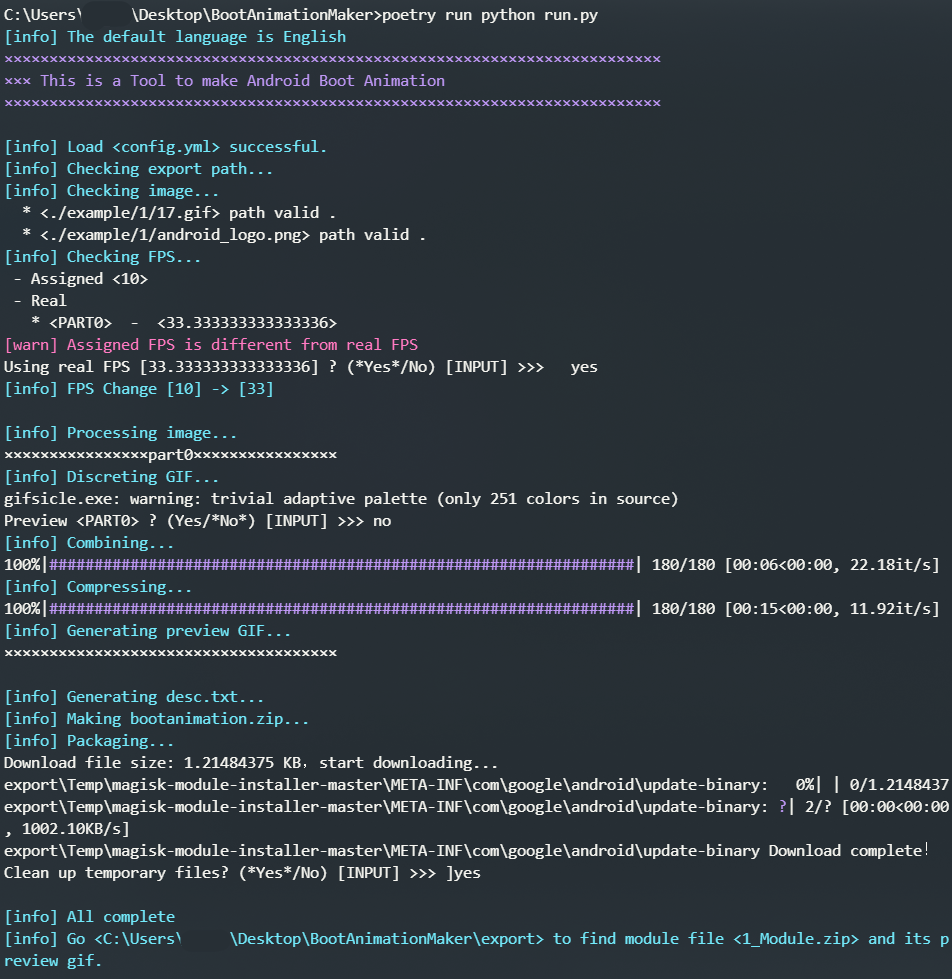

# BootAnimationMaker -- Android 系统开机动画 Magisk 模块制作工具

将图片 (png，jpg...)、动图 (gif) 组合制作 Android 系统开机动画，并将其打包成 Magisk 模块的工具

## 运行环境

### Python 及 Python 库依赖

```auto
python    >= 3.6

pillow    >= 5.3.0
tqdm      >= 4.28.1
requests  >= 2.20.1
colorama  >= 0.4.1
click     >= 7.0
pyyaml    >= 3.13
printtags >= 1.4
```

本项目使用 poetry 进行运行环境和依赖管理， 在脚本目录执行 `poetry install` 安装虚拟环境和依赖，执行 `poetry run python run.py` 运行脚本。

[poetry 安装及详细使用参考](https://github.com/sdispater/poetry)

### 其他依赖

本脚本还使用了 [gifsicle](https://www.lcdf.org/gifsicle/)、[pngquant](https://pngquant.org/) 等第三方软件，请根据平台不同使用相应的方法安装软件包

* Linux

  使用包管理器安装 `gifsicle`、`pngquant`

* Windows

  `gifsicle`、`pngquant` 为了方便已被默认包含到 `bin` 文件夹下，不须另行安装，如欲更换版本，则务必保证 `gifsicle.exe`、`pngquant.exe` 与当前的路径结构相同

* Mac

  暂时不支持，由于没有 Mac 设备，无法进行测试，欢迎 `pull requests`

## 使用方法

* 下载本脚本并解压或使用 `git clone`

* 准备图片素材，建议将其放置到脚本文件夹下的某一子文件夹中，新建 `config.yml` 文件，其格式参考 `config_template.yml`

* 在脚本根目录执行 `python run.py --config xxxx` 或 `poetry run python run.py --config xxxx` (若使用 poetry)


> `python run.py` 默认配置文件的路径为 `./config.yml`，可以使用 `--config` 指定路径 `python run.py --config xxxxx`


参考示例见 `example` 文件夹，以 `example/1` 为例，运行

```sh
python run.py --config ./example/1/config.yml
```



> 注意：`config.yml` 文件中的图片路径若为相对路径，则默认为相对于运行环境的相对路径，建议使用绝对路径以避免出错。

## 成品展示

> **声明**：图中素材均来源于互联网，仅供技术测试与展示使用，请勿商用，如有侵权请联系删除

<table>
    <tr>
        <td><center>Animation 1 </center></td>
        <td><center>Animation 2</center></td>
        <td><center>Animation 3</center></td>
        <td><center>Animation 4</center></td>
    </tr>
</table>

<table>
    <tr>
        <td><center>Animation 5 part 0</center></td>
        <td><center>Animation 5 part 1</center></td>
        <td><center>Animation 6 part 0</center></td>
        <td><center>Animation 6 part 1</center></td>
    </tr>
</table>

## 兼容性

原理上能兼容大部分的机型，由于我手头只有一加和小米的设备，只在一加和小米上测试通过，但据说三星的设备与其他设备的目录结构不一致，我没有进行过测试，因此不建议三星的用户使用本脚本做的动画。

## Q&A

1. 为什么使用 Magisk

对于大部分机型而言，原理上只需要替换系统 `/system/media/bootanimation.zip` 文件就可以实现开机动画的自定义，但之所以使用 Magisk，一是方便管理，随时可以更换和卸载，二是考虑到安全，不会因为意外情况造成无法开机的惨剧，建议在安装本脚本生成的开机动画模块之前（事实上应该在安装任何模块之前），先安装 [mm（Magisk Manager for Recovery Mode）](https://github.com/Magisk-Modules-Repo/mm)模块，这样在无法开机时就可以在 TWRP 中通过命令行手动删除有问题的模块。

1. 脚本用法好复杂好抽象

我也这么觉得，但我想不到更好的方式了，可能以后有精力写个带 UI 的版本更直观一些。当然了这个东西受众相当之少，现在这个东西已经能满足我的需求了，我不一定有动力去写。 

## license

[Apache Licnese 2.0](LICENSE)


